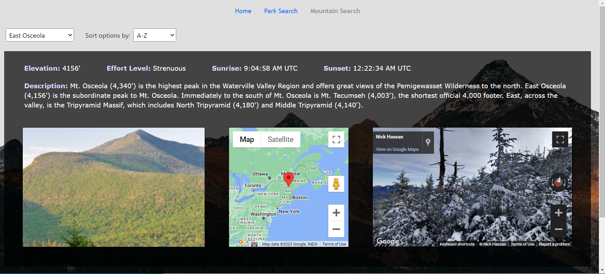

# Capstone-Project-2: Outsidë Lands

Outsidë Lands is a website that displays various national parks and mountains, as well as information about them. It features voice command navigation, Google Maps integration, and animations.

## Screenshots

Home page:


Mountains page:


Parks page:


## Snippet
One interesting bit of JavaScript I wrote was for how I implemented buttons to close an individual park's information display element. Because the button is located inside the park's ```<li>``` element (i.e. parkLi), clicking on the button would originally just trigger the parkLi's onclick function. 

I attempted to fix the problem through a few different approaches: a boolean flag variable that would act as "state," altering the .value property of the parkLi, and even putting the button outside of the parkLi (this worked, but I didn't like how it looked).

Eventually, I solved the issue by reassigning the parkLi's onclick to null inside the parkLi's onclick itself, then resetting it to its original value inside the button's onclick. I needed to reset it in a setTimeout because without the setTimeout, clicking the button would still trigger the original parkLi onclick even though I only reassigned the original inside the button's onclick.

Here is the code, significantly abridged and modified for clarity:

/js/parks.js
```
const qS = document.querySelector.bind(document);

parkLi.onclick = () => displayParkInfo(parkLi);

const displayParkInfo = (parkLi) => {
  // rewrite onclick, otherwise clicking the btn will just trigger the original parkLi.onclick again
  parkLi.onclick = null; 

  qS(`button#${id}-close`).onclick = () => {
    // w/o setTimeout, clicking the btn still triggers the onclick re-assigned below
    setTimeout(() => parkLi.onclick = () => displayParkInfo(parkLi), 500);
  };
};
```